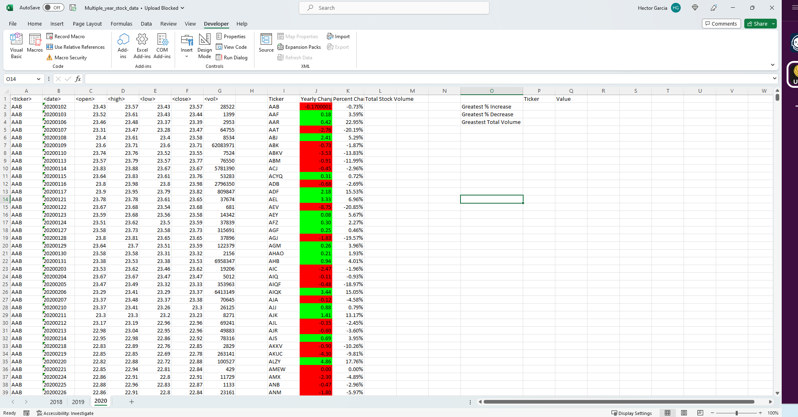

# VBA-challenge

## Table of Contents
* [Summary](#general-information)
* [Technologies Used](#technologies-used)
* [Screenshots](#screenshots)
* [Sources](#setup)
* [Contact](#contact)

## Summary
Create a script that loops to give you different information on stocks. It creates a ticker column, a percent change column and a yearly change column. At the end of the script it should be able to pull the highest and lowest changes.

## Technologies Used 
* VBA
* Excel

## Screenshots 

## Sources
* Used a number of different sources when stuck. These include StackOverflow, GitHub and ASKBCS

## Contact
Created by Hector Garcia - feel free to contact me!